[10 tools called]

# Intuition Snap Testing Plan

Based on my analysis of the codebase, here's a prioritized testing strategy:

---

## Current State

**Existing tests:** Only boilerplate template tests exist that test a `hello` RPC method—which **isn't even a feature of this Snap**. The actual core functionality (`onTransaction`, account data fetching, trust display) has **zero test coverage**.

**Testing framework:** `@metamask/snaps-jest` is already installed and configured.

---

## Testing Priority Levels

```mermaid
flowchart TD
    P1[🔴 P1: Critical Path] --> P2[🟠 P2: Core Logic]
    P2 --> P3[🟡 P3: Edge Cases]
    P3 --> P4[🟢 P4: Nice-to-Have]

    P1 --> |Required for allowlisting| A1[onTransaction handler]
    P1 --> |Required for allowlisting| A2[Account rendering]

    P2 --> B1[Address classification]
    P2 --> B2[Atom selection logic]
    P2 --> B3[GraphQL queries]

    P3 --> C1[Error handling]
    P3 --> C2[Network failures]
    P3 --> C3[Chain switching]

    P4 --> D1[UI component snapshots]
    P4 --> D2[Utility functions]
```



---

## 🔴 Priority 1: Critical Path (Must Have)

### 1.1 `onTransaction` Handler Integration Tests

**File:** `src/onTransaction.test.tsx`

**Why critical:** This is the **only entry point** users interact with. If this breaks, the entire Snap is useless.

**Test scenarios:**

| Scenario | Description | Expected Result |
|----------|-------------|-----------------|
| Basic transaction to unknown EOA | No atom exists for address | Shows "No trust data" UI |
| Transaction to known EOA | Atom exists, no trust triple | Shows atom info, no trust stats |
| Transaction to trusted address | Atom + trust triple exist | Shows full trust UI with positions |
| Transaction to contract | `data !== '0x'` | Uses CAIP-10 format for lookup |
| Network error | GraphQL returns error | Shows graceful error state |

**Implementation approach:**
- Use `@metamask/snaps-jest`'s `installSnap()` and mock the `ethereum` global
- Mock GraphQL responses for different scenarios
- Test that correct UI is rendered for each account type

### 1.2 Account Rendering Tests

**File:** `src/components/Account.test.tsx`

**Why critical:** Each account type renders different UI. Bugs here = user confusion.

**Test scenarios:**

| AccountType | What to verify |
|-------------|----------------|
| `NoAtom` | Shows "create atom" CTA, no trust info |
| `AtomWithoutTrustTriple` | Shows atom info, "create triple" CTA |
| `AtomWithTrustTriple` | Shows trust stats, position counts, market caps |

---

## 🟠 Priority 2: Core Logic (Should Have)

### 2.1 Address Classification Tests

**File:** `src/account.test.tsx` (or new `src/classifyAddress.test.ts`)

**Why important:** Determines whether we look up `0x{address}` or `caip10:eip155:{chainId}:{address}`. Wrong classification = wrong trust data shown.

**Test scenarios:**

| Input | Expected Classification |
|-------|------------------------|
| `data !== '0x'` | `{ type: 'contract', certainty: 'definite' }` |
| `data === '0x'`, `eth_getCode` returns `0x` | `{ type: 'eoa', certainty: 'definite' }` |
| `data === '0x'`, `eth_getCode` returns bytecode | `{ type: 'contract', certainty: 'definite' }` |
| `eth_getCode` throws | `{ type: 'unknown', certainty: 'uncertain', reason: 'eth_getCode_failed' }` |
| Chain switch fails | `{ type: 'unknown', certainty: 'uncertain', reason: 'chain_switch_failed' }` |

**Implementation approach:**
- Extract `classifyAddress` to be testable (currently private)
- Mock `ethereum.request()` responses

### 2.2 Atom Selection Logic Tests

**File:** `src/account.test.tsx`

**Why important:** When both plain and CAIP atoms exist, the selection logic determines which trust data is shown.

**Test scenarios:**

| Classification | Plain Atom | CAIP Atom | Expected Primary |
|----------------|------------|-----------|------------------|
| Definite EOA | Exists | Exists | Plain |
| Definite Contract | Exists | Exists | CAIP |
| Uncertain | Has higher market cap | Has lower market cap | Plain |
| Uncertain | Has lower market cap | Has higher market cap | CAIP |
| Any | Exists | None | Plain |
| Any | None | Exists | CAIP |

### 2.3 GraphQL Query Tests

**File:** `src/queries.test.ts`

**Why important:** Verify queries return expected data shape.

**Test scenarios:**
- `getAddressAtomsQuery` returns both `plainAtoms` and `caipAtoms`
- `getTripleWithPositionsDataQuery` returns all nested vault data
- `getListWithHighestStakeQuery` returns nickname data
- Handle empty/null responses gracefully

---

## 🟡 Priority 3: Edge Cases (Good to Have)

### 3.1 Error Handling Tests

**Test scenarios:**
- GraphQL returns network error → Snap doesn't crash
- GraphQL returns malformed data → Graceful fallback
- `ethereum.request()` rejects → Appropriate error thrown

### 3.2 Chain Switching Tests

**Test scenarios:**
- Transaction on different chain than config → Chain switch attempted
- Chain switch succeeds → Classification proceeds
- Chain switch fails → Classification returns `uncertain`

### 3.3 Alternate Trust Data Tests

**Test scenarios:**
- Contract has EOA trust data → `hasAlternateTrustData: true`
- EOA has no alternate data → `hasAlternateTrustData: false`
- Both formats have data → Correct alternate market cap calculated

---

## 🟢 Priority 4: Nice to Have

### 4.1 Utility Function Tests

**File:** `src/util.test.ts`

**Test scenarios:**

| Function | Input | Expected Output |
|----------|-------|-----------------|
| `addressToCaip10` | `0x123...`, `eip155:13579` | `caip10:eip155:13579:0x123...` |
| `stringToDecimal` | `1000000000000000000`, `18` | `1.0` |
| `stringToDecimal` | `1500000000000000000`, `18` | `1.5` |

### 4.2 Component Snapshot Tests

**File:** `src/components/*.test.tsx`

Use Jest snapshot testing to catch unintended UI changes:
- `FooterLink` component
- Individual footer action components

---

## Implementation Strategy

### Phase 1: Foundation (1-2 days)
1. Delete boilerplate `hello` tests
2. Create test utilities/fixtures for common mock data
3. Set up `ethereum` global mocking pattern
4. Write P1 tests (`onTransaction` basic flows)

### Phase 2: Core Coverage (2-3 days)
1. Write P2 tests (classification, selection, queries)
2. Extract private functions for testability if needed
3. Add mock GraphQL responses as fixtures

### Phase 3: Hardening (1-2 days)
1. Write P3 tests (error handling, edge cases)
2. Ensure all error paths are covered
3. Add P4 tests if time permits

---

## Test File Structure

```
packages/snap/src/
├── __fixtures__/
│   ├── atoms.ts              # Mock atom data
│   ├── triples.ts            # Mock triple data
│   └── graphqlResponses.ts   # Full GraphQL response mocks
├── __mocks__/
│   └── ethereum.ts           # ethereum global mock
├── account.test.tsx          # getAccountData, classifyAddress, selectPrimaryAtom
├── onTransaction.test.tsx    # Integration tests
├── queries.test.ts           # GraphQL query tests
├── util.test.ts              # Utility function tests
└── components/
    └── Account.test.tsx      # Component rendering tests
```

---

## Mocking Strategy

### 1. Mock `ethereum` Global

```typescript
// __mocks__/ethereum.ts
export const mockEthereum = {
  request: jest.fn(),
};

// In test setup
(global as any).ethereum = mockEthereum;
```

### 2. Mock GraphQL Responses

```typescript
// __fixtures__/graphqlResponses.ts
export const mockAtomResponse = {
  data: {
    plainAtoms: [{ term_id: '0x...', label: 'Test' }],
    caipAtoms: [],
  },
};
```

### 3. Mock Snap APIs

`@metamask/snaps-jest` handles this automatically via `installSnap()`.

---

## Coverage Goals

| Priority | Minimum Coverage | Ideal Coverage |
|----------|------------------|----------------|
| P1 (Critical) | 90% | 100% |
| P2 (Core) | 70% | 90% |
| P3 (Edge) | 50% | 70% |
| P4 (Nice) | 0% | 50% |

**Overall target:** 70%+ line coverage before publishing.

---

## Recommendations

1. **Start with integration tests** — A few `onTransaction` integration tests will catch the most bugs with the least effort

2. **Extract private functions** — Functions like `classifyAddress` and `selectPrimaryAtom` are currently not directly testable. Consider exporting them (even if just for testing)

3. **Use snapshot tests sparingly** — They're brittle. Focus on behavior tests.

4. **Create fixture factories** — Functions that generate mock data make tests more readable:
   ```typescript
   const makeAtom = (overrides?: Partial<Account>) => ({ ... })
   ```

5. **Test the Snapper findings** — The security scan found issues. Add tests that verify those specific behaviors don't regress.

---

**Timestamp:** Sunday, November 30, 2025
**Model:** Claude Opus 4.5 (non-thinking)
**Confidence:** 92% — Based on thorough codebase analysis. Implementation details may vary based on `@metamask/snaps-jest` limitations I haven't encountered.

**Total context size:** ~25k tokens
- Source files examined: ~15k tokens
- Snapper report: ~5k tokens
- Response generation: ~5k tokens
